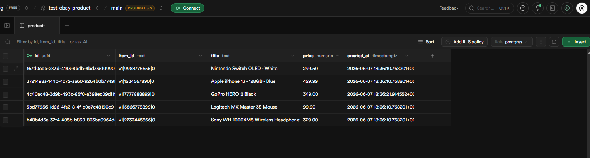

# eBay Product API

A simple REST API built with **Node.js + TypeScript (Express)** that accepts mock
eBay product data and saves it to **Supabase** (PostgreSQL).

```
POST /api/products   ->  save a product   (title, price, item_id)
GET  /api/products   ->  list saved products
GET  /health         ->  health check
```

---

## Table of contents

1. [Tech stack](#tech-stack)
2. [Project structure](#project-structure)
3. [Step 1 — Set up Supabase (from scratch)](#step-1--set-up-supabase-from-scratch)
4. [Step 2 — Configure & run the API](#step-2--configure--run-the-api)
5. [Step 3 — Send a request](#step-3--send-a-request)
6. [Screenshot — data saved in Supabase](#screenshot--data-saved-in-supabase)
7. [API reference](#api-reference)
8. [Running with Docker](#running-with-docker)
9. [Tests](#tests)
10. [Design notes](#design-notes)

---

## Tech stack

| Concern        | Choice                                   |
| -------------- | ---------------------------------------- |
| Language       | TypeScript                               |
| HTTP framework | Express                                  |
| Database       | Supabase (PostgreSQL) via `@supabase/supabase-js` |
| Validation     | Zod                                      |
| Tests          | Vitest + Supertest                       |
| Container      | Docker (multi-stage build)               |

## Project structure

```
src/
  types/product.ts           # Domain model (ProductInput -> ProductRecord)
  types/http.ts              # API response envelopes + typed handler
  types/database.ts          # Supabase schema type (types the DB client)
  config/env.ts              # Validates environment variables at startup
  lib/supabase.ts            # Single shared, fully-typed Supabase client
  validation/product.schema.ts  # Zod schema, bound to the ProductInput type
  services/product.service.ts   # Database access (insert / list)
  controllers/product.controller.ts  # Request -> validate -> service -> response
  routes/product.routes.ts   # Maps HTTP routes to controllers
  middleware/errorHandler.ts # 404 + centralized error responses
  errors.ts                  # Typed HTTP errors (e.g. 409 Conflict)
  app.ts                     # Builds the Express app (exported for tests)
  index.ts                   # Starts the HTTP server
tests/product.test.ts        # Endpoint tests (service layer mocked)
scripts/migrate.ts           # Creates the table (runs schema.sql via Postgres)
scripts/seed.ts              # Inserts sample eBay products (idempotent upsert)
supabase/schema.sql          # SQL to create the products table
```

---

## Step 1 — Set up Supabase (from scratch)

> You only need a free Supabase account — no credit card required.

1. **Create an account & project**
   - Go to <https://supabase.com> and sign up (e.g. with GitHub or email).
   - Click **New project**, give it a name, set a database password, pick a
     region, and click **Create new project**. Wait ~1 minute for it to finish
     provisioning.

2. **Create the `products` table**
   - In the left sidebar open **SQL Editor → New query**.
   - Paste the contents of [`supabase/schema.sql`](supabase/schema.sql) and click
     **Run**. This creates the table below:

     | column       | type            | notes                          |
     | ------------ | --------------- | ------------------------------ |
     | `id`         | `uuid`          | primary key, auto-generated    |
     | `item_id`    | `text`          | **unique** (eBay item id)      |
     | `title`      | `text`          | required                       |
     | `price`      | `numeric(12,2)` | required, must be `>= 0`       |
     | `created_at` | `timestamptz`   | defaults to now()              |

3. **Grab your credentials** (you'll paste these into `.env` next)
   - Go to **Project Settings → API**.
   - Copy the **Project URL** → this is `SUPABASE_URL`.
   - Copy the **secret** server key → this is `SUPABASE_KEY`:
     - New projects: **API Keys → Secret keys** (value starts with `sb_secret_`).
     - Older projects: the **`service_role`** key under **Project API keys**.

   > ⚠️ Use the **secret / service_role** key, **not** the **publishable / anon**
   > key — the publishable key is blocked by Row Level Security, so inserts will
   > fail. This secret key has full database access, is used **server-side
   > only**, and is never exposed to clients. The `.env` file that holds it is
   > git-ignored.

---

## Step 2 — Configure & run the API

**Requirements:** Node.js 18+ (developed on Node 22).

```bash
# 1. Install dependencies
npm install

# 2. Create your env file from the template, then fill in the two values
cp .env.example .env       # Windows PowerShell: copy .env.example .env

# 3. Start the dev server (auto-reloads on changes)
npm run dev
```

You should see:

```
🚀 eBay Product API listening on http://localhost:3000
```

> **Production build:** `npm run build` compiles to `dist/`, then `npm start`
> runs the compiled server.

### Environment variables

| Variable       | Required | Default | Description                                              |
| -------------- | -------- | ------- | -------------------------------------------------------- |
| `SUPABASE_URL` | yes      | —       | Your Supabase Project URL                                |
| `SUPABASE_KEY` | yes      | —       | Your Supabase **secret** / `service_role` key            |
| `DATABASE_URL` | no\*     | —       | Postgres connection string — only for `npm run db:migrate` |
| `PORT`         | no       | `3000`  | Port the API listens on                                  |

\* `DATABASE_URL` is only needed if you run the migration script (below). The API
itself runs without it.

If a required variable is missing or malformed, the app exits immediately with a
clear message instead of failing later.

### Database: migrations & seeding (optional, but reproducible)

Instead of pasting SQL into the dashboard, you can manage the database from code:

```bash
npm run db:migrate   # creates the products table (runs supabase/schema.sql)
npm run db:seed      # inserts a few sample eBay products (idempotent upsert)
npm run db:setup     # migrate + seed in one step
```

- **`db:migrate`** connects directly to Postgres (via `DATABASE_URL`) because
  table creation is DDL, which the Supabase REST key can't perform. It's safe to
  re-run (`create table if not exists`).
- **`db:seed`** uses the app's own typed Supabase client, so it needs only
  `SUPABASE_URL` + `SUPABASE_KEY` (the **secret** key).

Get `DATABASE_URL` from **Project Settings → Database → Connection string → URI**
and put it in `.env` (replace `[YOUR-PASSWORD]` with your database password).

---

## Step 3 — Send a request

**curl (macOS/Linux/Git Bash):**

```bash
curl -X POST http://localhost:3000/api/products \
  -H "Content-Type: application/json" \
  -d '{"title":"Apple iPhone 13 - 128GB","price":429.99,"item_id":"v1|1234567890|0"}'
```

**PowerShell (Windows):**

```powershell
Invoke-RestMethod -Uri http://localhost:3000/api/products -Method Post `
  -ContentType "application/json" `
  -Body '{"title":"Apple iPhone 13 - 128GB","price":429.99,"item_id":"v1|1234567890|0"}'
```

**Response (`201 Created`):**

```json
{
  "data": {
    "id": "8f7c1e2a-...",
    "item_id": "v1|1234567890|0",
    "title": "Apple iPhone 13 - 128GB",
    "price": 429.99,
    "created_at": "2026-06-07T12:00:00.000Z"
  }
}
```

Then confirm it was saved either by opening **Table Editor → products** in the
Supabase dashboard, or by calling `GET http://localhost:3000/api/products`.

> A ready-to-run [`requests.http`](requests.http) file is included for the VS Code
> "REST Client" / JetBrains HTTP client.

---

## Screenshot — data saved in Supabase

The mock eBay products persisted to the `products` table, viewed in the Supabase
**Table Editor**:



---

## API reference

### `POST /api/products`

Request body:

| field     | type   | rules                          |
| --------- | ------ | ------------------------------ |
| `title`   | string | required, 1–500 chars          |
| `price`   | number | required, `>= 0`, finite       |
| `item_id` | string | required, 1–100 chars, unique  |

Responses:

| status            | meaning                                            |
| ----------------- | -------------------------------------------------- |
| `201 Created`     | Product saved; returns the stored row in `data`    |
| `400 Bad Request` | Validation failed (returns a `details` array) or malformed JSON |
| `409 Conflict`    | A product with that `item_id` already exists       |
| `500`             | Unexpected server/database error                   |

Example validation error (`400`):

```json
{
  "error": {
    "message": "Validation failed",
    "details": [
      { "field": "price", "message": "price must be a number" },
      { "field": "item_id", "message": "item_id is required" }
    ]
  }
}
```

### `GET /api/products`

Returns all saved products, newest first:

```json
{ "data": [ /* ...products... */ ], "count": 1 }
```

### `GET /health`

```json
{ "status": "ok" }
```

---

## Running with Docker

The multi-stage [`Dockerfile`](Dockerfile) builds the TypeScript and ships only
production dependencies.

```bash
# Build the image
docker build -t ebay-product-api .

# Run it, passing your env file
docker run --rm -p 3000:3000 --env-file .env ebay-product-api
```

The API is then available at <http://localhost:3000>.

---

## Tests

Endpoint tests use Supertest against the Express app with the database layer
**mocked**, so they run fast and need no Supabase credentials or network.

```bash
npm test
```

They cover: successful save (201), validation failures (400), duplicate
`item_id` (409), malformed JSON (400), listing products, and the health check.

---

## Design notes

- **Layered structure** (`routes → controller → service → supabase`) keeps each
  file small and single-purpose, and lets tests target the controller logic
  without a real database.
- **End-to-end type safety** — domain interfaces (`ProductInput → ProductRecord`,
  built with `extends`) flow through a typed Supabase client (so DB reads/writes
  are checked with no `as` casts), typed response envelopes (`ApiResource<T>`,
  `ApiCollection<T>`), and a typed `AsyncHandler<ResBody>`. The Zod schema is
  bound to `ProductInput` via `satisfies`, so validation and types can't drift.
- **Validation at the edge** with Zod — the database is never touched with
  invalid data, and clients get precise, field-level error messages.
- **Fail-fast configuration** — environment variables are validated at startup.
- **Typed errors** — services throw `HttpError`/`ConflictError`; one central
  handler turns them into consistent JSON responses.
- **`item_id` is unique** — re-sending the same eBay item returns `409` rather
  than silently duplicating rows.
